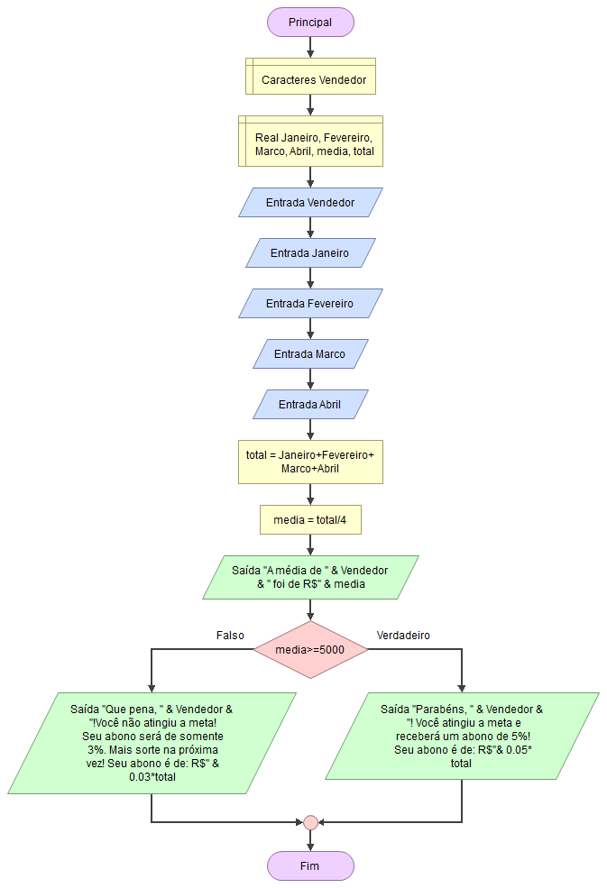

# Notas das Aulas - Lógica de Programação Essencial :computer:

## Informações Básicas

**Professor:** Denilson Bonatti

**Tempo de duração:** 4h

**Descrição:** Curso básico introdutório a respeito de lógica de programação e alguns recursos dentro dela. Variando entre aulas teóricas e exercícios práticos.

**Conteúdo trabalhado / Habilidades Desenvolvidas:**

- Estruturação de raciocínio para resolução de problemas; 
- Fluxogramas;
- Variáveis e constantes;
- Tomadas de decisão e expressões;
- Concatenação;
- Estruturas de Repetição;
- Desvios condicionais e boas práticas em programação;
- Portugol;
- Aplicação prática com matrizes e vetores.

## Softwares utilizados em aula

- [Portugol Studio](https://github.com/UNIVALI-LITE/Portugol-Studio/releases); 
- [Flowgorithm](http://www.flowgorithm.org/download/index.html).

## Atividades realizadas

1. **Resolução de problemas de raciocínio lógico** 

   - [Problemas Minecraft](https://studio.code.org/s/mc/lessons/1/levels/1)

   - [Problema lobo, ovelha e repolho](https://www.proprofsgames.com/wolf-sheep-and-cabbage/)

     

2. **Pseudocódigo para problema dos Pinguins**

   [Pinguins numa fria](https://rachacuca.com.br/jogos/pinguins-numa-fria/)

   Pseudocódigo criado para resolução:

   ​	Inicio-Jogo
   ​		Sobe Filhote Azul
   ​		Sobe Pai Azul
   ​		Atravessa
   ​		Desce Pai Azul
   ​		Atravessa
   ​		Sobe Filhote Verde
   ​		Atravessa
   ​		Desce Filhote Azul
   ​		Atravessa
   ​		Sobe Pai Verde
   ​		Atravessa
   ​		Desce Pai Verde
   ​		Atravessa
   ​		Sobe Filhote Vermelho
   ​		Atravessa
   ​		Desce Filhote Verde
   ​		Atravessa
   ​		Sobe Pai Vermelho
   ​		Atravessa
   ​		Desce Pai Vermelho
   ​		Desce Filhote Vermelho
   ​	Fim-Jogo

   

3. **Cálculo da tabuada**

   Código para calcular tabuada de 0 até o limite inserido pelo usuário e  de algum numeral inteiro também  definido pelo usuário.

   - Fluxograma

     

     

   - Código no Portugol

   	programa{
   	
   		funcao inicio()
   		{
   			inteiro contador, limite, resultado, tabuada
   		
   			contador = 0
   		
   			//usuário insere o número que será feito a tabuada
   			escreva("A tabuada de qual número você deseja exibir? ")
   			leia(tabuada)
   		
   			//usuário insere o limite que deseja
   			escreva("Até qual número você deseja multiplicar? ")
   			leia (limite)
   		
   			//Indicando ao usuário opções escolhidas:
   			// "\n" significa quebra de linha
   			escreva("A tabuada do " + tabuada + " até o " + limite + " é:" + "\n")
   			
   			//iniciando looping da tabuada
   			faca {
   				escreva(tabuada + "x" + contador + " = " + tabuada*contador + "\n")
   				//adicionando 1 ao contador para ir para o próximo valor de multiplicação
   				contador ++
   			
   			}enquanto (contador <= limite)	
   		}
   	}

   ​	

4. **Cálculo de Média dos vendedores**

   Calcular o total de vendas de um vendedor, a sua média do primeiro quadrimestre, e o seu abono de vendas conforme a média obtida

   - Fluxograma

     

   - Código no Portugol

     	programa{
     		funcao inicio()
     		{
     			real Janeiro, Fevereiro, Marco, Abril, total, media
     			cadeia Vendedor
     		
     			//Identificando o vendedor
     			escreva("Insira o nome do vendedor:")
     			leia(Vendedor)
     		
     			//Recebendo os valores mensais de vendas do Primeiro Quadrimestre
     			escreva("Insira o valor de vendas de Janeiro:")
     			leia(Janeiro)
     			escreva("Insira o valor de vendas de Fevereiro:")
     			leia(Fevereiro)
     			escreva("Insira o valor de vendas de Março:")
     			leia(Marco)
     			escreva("Insira o valor de vendas de Abril:")
     			leia(Abril)
     		
     			//Calculando o Total de Vendas
     			total = Janeiro+Fevereiro+Marco+Abril
     	
     			//Calculando média
     			media = total/4
     		
     			//Exibindo a média de vendas do vendedor
     			escreva("A média de vendas de " + Vendedor + " foi de R$" + media + "."+"\n")
     	
     		//Verificando se o valor está acima da média que é de R$5.000,00
     		se(media>=5000){escreva("Parabéns," + Vendedor + "! Você atingiu a meta e receberá um abono de 5%! Seu abono é de:R$"+0.05*total)}
     		//Exibindo o resultado que ficou abaixo da média
     		senao{escreva("Que pena, " + Vendedor + "! Você não atingiu a meta! Seu abono será de somente 3%. Mais sorte na próxima vez! Seus abono é de R$"+0.03*total)}
     		}
     	}
     

5. **Uso da função Caso**

   Simulando um menu de seleção básico como treinamento do uso da função "Caso" no Portugol

   
   	programa
   	{
   		funcao inicio()
   		{
   			inteiro menu
   			//expondo as opções ao usuário
   			escreva("Opções de seleção:" + "\n" + "1 - Abrir Netflix " + "\n" + "2 - Abrir HBO GO " + "\n" + "3 - Abrir Amazon Prime " + "\n" + "4 - Sair ")
   		
   			//usuário inserindo a opção desejada
   			escreva("\n" + "Digite sua opção: ")
   			leia(menu)
   	
   			//Executando a opção selecionada
   			escolha (menu)
   			{
   				caso 1: 	//testando se o valor for a opção 1
   				escreva("Abrindo Netflix")
   				pare
   				
   				caso 2: 	//testando se o valor for a opção 2
   				escreva("Abrindo HBO GO")
   				pare
   				
   				caso 3: 	//testando se o valor for a opção 3
   				escreva("Abrindo Amazon Prime")
   				pare
   				
   				caso 4: 	//testando se o valor for a opção 4
   				escreva("Saindo...")
   				pare			
   		
   				caso contrario:
   				escreva( "Você deve selecionar 1,2,3 ou 4.")
   		 	
   			}  
   		}
   	}
   
6. **Uso Matriz**

Código para treinar o uso de matriz no Portugol

programa
{
	
	programa {
	
		funcao inicio()
		{
			inteiro contador=0
			
			//Na matriz funciona tipo(cadeia/inteiro/real...), nome da matriz (dados), [][] = [linha][coluna]
			cadeia dados[][]={
				{"João" , "São Paulo" , "(11)9999-5241"},
				{"Maria" , "Ribeirão Preto" , "(16)9999-8596"},
				{"Ana" , "Manaus" , "(11)9999-8574"}
				}
		
			faca{
			
				escreva("Cliente: " + dados[contador][0] + "\n" +
					"Cidade: " + dados[contador][1] + "\n" +
					"Telefone: " + dados[contador][2] + "\n"+ "\n")
				
				contador++
			
				}enquanto(contador<=2)
		}
	}
